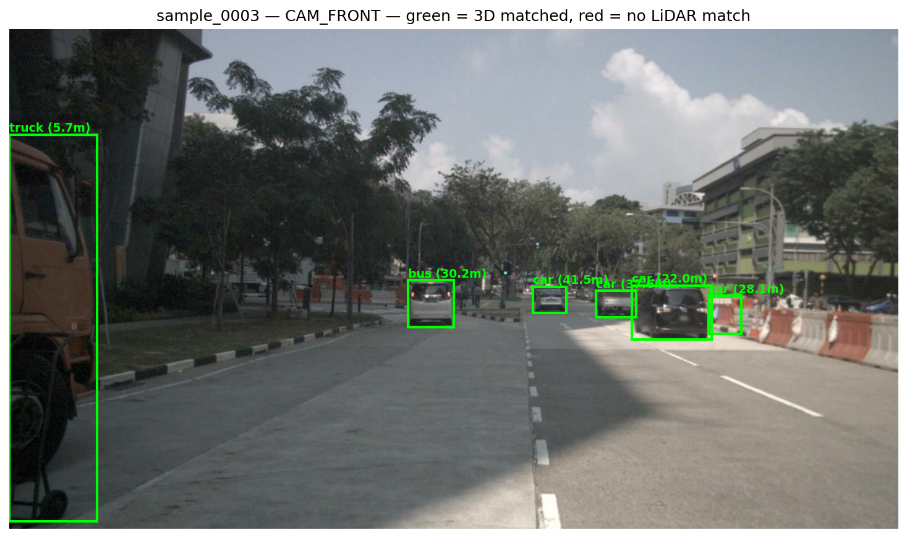
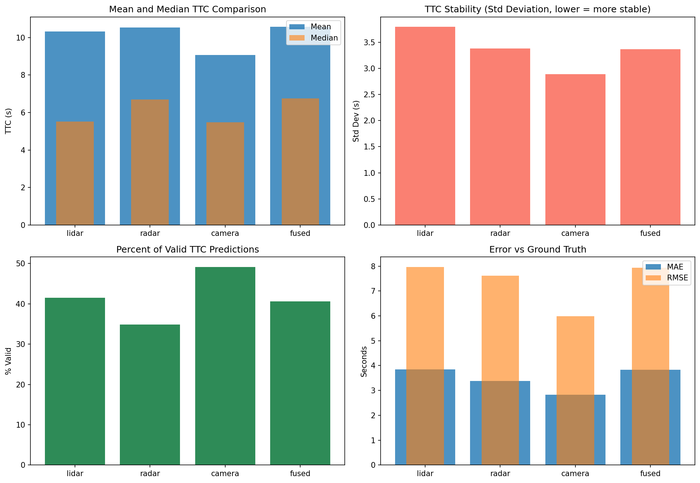
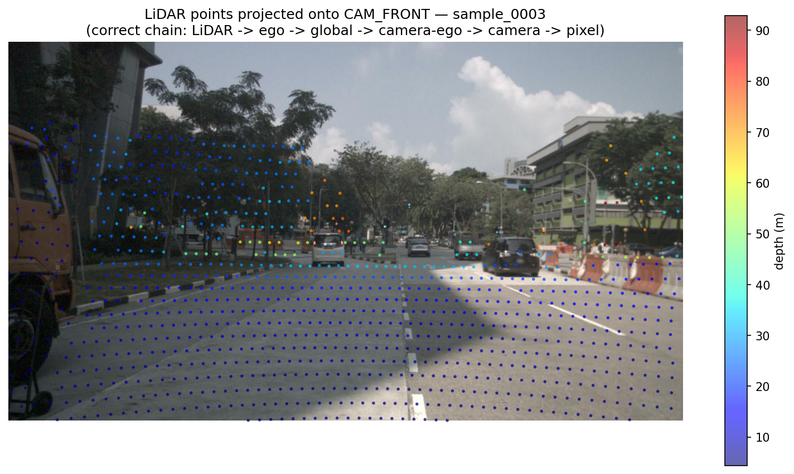
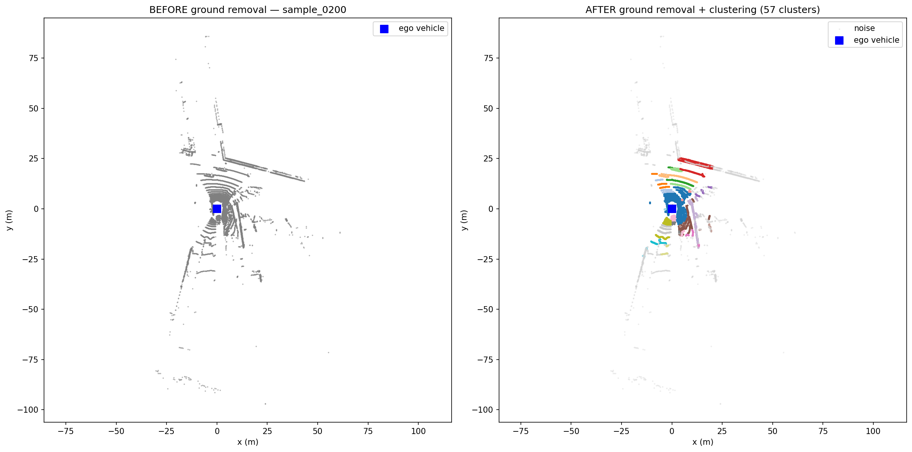
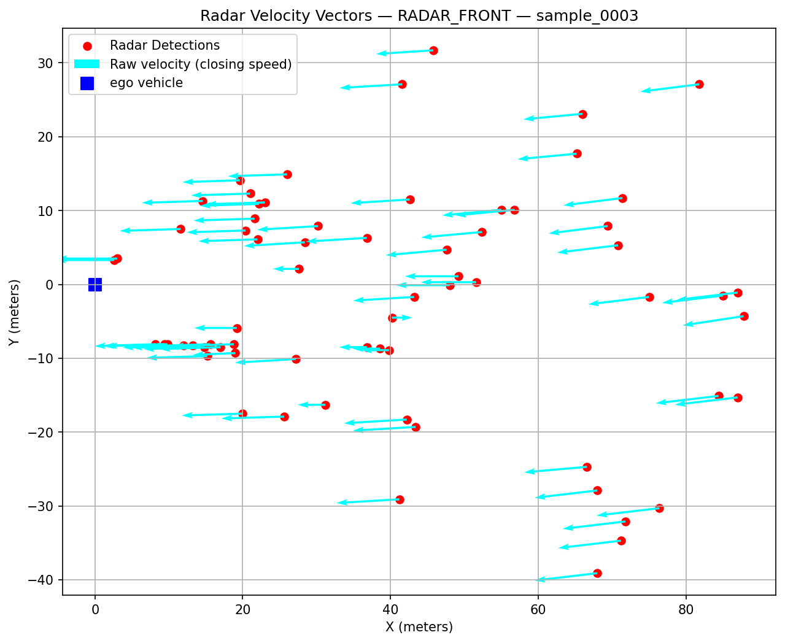

# Multi-Sensor Fusion for Time-to-Collision Estimation

A camera + radar + LiDAR fusion pipeline built on the [nuScenes v1.0-mini](https://www.nuscenes.org/) dataset. It reconstructs per-object tracks in a global frame from raw sensor logs, fuses them across all three modalities, and estimates Time-to-Collision (TTC) using an Unscented Kalman Filter with a CTRV motion model — then evaluates every sensor's TTC estimate (and the fused estimate) against ground-truth annotations.

<p align="center">
  
</p>

## Pipeline stages

The pipeline is a sequence of 17 Jupyter notebooks, run in order, each reading the previous stage's output from disk and writing its own:

| Stage | Notebook | What it does |
|---|---|---|
| 0 | `Step_0_Dataset_Preparation.ipynb` | Indexes nuScenes samples; writes the master sample index every later step reads |
| 1.1 | `Step_1_1_Camera_Preprocessing.ipynb` | Camera calibration/intrinsics per sample |
| 1.2 | `Step_1_2_Radar_Parsing.ipynb` | Parses raw radar point clouds per channel |
| 1.3 | `Step_1_3_LiDAR_Parsing.ipynb` | Parses raw LiDAR point clouds |
| 2.1 | `Step_2_1_LiDAR_Processing.ipynb` | Ground-plane removal (Open3D) + DBSCAN clustering |
| 2.2 | `Step_2_2_Radar_Processing.ipynb` | Radar filtering + feature extraction (raw and ego-compensated velocity) |
| 2.3 | `Step_2_3_YOLOv5.ipynb` | YOLO 2D object detection on camera frames |
| 2.3.1 | `Step_2_3_1_YOLO_Global_Projection.ipynb` | Lifts each 2D YOLO box to a 3D global-frame position using LiDAR |
| 3.1 | `Step_3_1_LiDAR_Fusion.ipynb` | Multi-frame LiDAR tracking (Hungarian assignment), global frame |
| 3.2 | `Step_3_2_Radar_Fusion.ipynb` | Multi-frame radar tracking, same family as 3.1 |
| 3.3 | `Step_3_3_Camera_Tracker.ipynb` | Multi-frame camera tracking, global 3D nearest-neighbor across all 6 cameras |
| 4 | `Step_4_Fusion.ipynb` | Fuses LiDAR/radar/camera tracks into unified tracks |
| 5 | `Step_5_TTC.ipynb` | UKF + CTRV motion model → TTC estimate per track, per sensor and fused |
| 6 | `Step_6_Visualization.ipynb` | Trend plots + evaluation metrics against nuScenes ground truth |
| 7 | `Step_7_Pipeline_Audit.ipynb` | Read-only audit: checks input/output counts and known-bug regressions at every stage |
| — | `Validate_Step_2_3_1.ipynb` | Standalone validator for Step 2.3.1's 3D projections |

Each notebook's first cell documents its own Input / Outputs / Used-by contract — read it before changing a stage's output format, since downstream notebooks depend on it exactly.

## Results

<p align="center">
  
</p>

`Step_6_Visualization.ipynb` computes these metrics — mean/median TTC, estimate stability (std. dev.), the fraction of tracks with a valid TTC prediction, and MAE/RMSE against nuScenes ground-truth annotations — per sensor and for the fused estimate. The full numbers for a given run are written to `output/step_6/evaluation_metrics.csv`.

### Pipeline stages, visually

| LiDAR → camera projection check | Ground removal + clustering |
|---|---|
|  |  |

| Radar detections + velocity | YOLO detections with LiDAR-derived range |
|---|---|
|  |  |

## Repository layout

```
config.py              # Single source of truth for all paths — set DATA_ROOT here
src/
  geometry.py           # Shared sensor-to-global and global-to-camera transform utilities,
                         # imported by Step 1.1, 2.3.1, 3.1, and 3.2 instead of being
                         # redefined in each notebook
Step_*.ipynb            # The 17 pipeline stages (see table above)
assets/                 # Curated result images used in this README
requirements.txt
output/                 # Generated by running the pipeline (gitignored)
```

## Setup

```bash
git clone https://github.com/sivak01/multimodal-perception-ttc.git
cd multimodal-perception-ttc
pip install -r requirements.txt
```

### Dataset

This repo does **not** include the nuScenes dataset. Download the `v1.0-mini` split from [nuscenes.org](https://www.nuscenes.org/nuscenes#download) (registration required) and point `config.py`'s `DATA_ROOT` at the extracted `archive/` folder:

```python
DATA_ROOT = Path(r"path/to/your/nuscenes/archive")
```

nuScenes data is distributed by Motional under its own [terms of use](https://www.nuscenes.org/terms-of-use), which are separate from this repository's license — see [LICENSE](LICENSE).

### Running the pipeline

Notebooks must be run in numeric order, since each stage's outputs feed the next. Open them in Jupyter/VS Code and run all cells, or execute headlessly:

```bash
jupyter nbconvert --to notebook --execute --inplace "Step_0_Dataset_Preparation.ipynb"
```

## License

MIT — see [LICENSE](LICENSE). Does not cover the nuScenes dataset itself.
